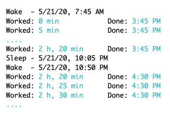

# WorkTimer

CLI utility to track overall work time for people who use (macOS) work computer exclusively for work. 

When working from home without an alarm clock (other than young kids) the daily schedule varies. Between that and other breaks (to play with the kids) it is harder to keep track of the hours worked. 

This simple utility tracks hours when the computer is awake, starting freshly each day, by tracking sleep/wake events.

### Sample Output




### Usage

```
./work-timer -h
OVERVIEW: An utility for tracking time worked on a work computer.

USAGE: work-timer [--work-hours <work-hours>] [--freq <freq>]

OPTIONS:
  --work-hours <work-hours>
                          Number of hours in a workday (default: 8.0)
  --freq <freq>           Number of minutes between work time status reports (default: 5.0)
  --version               Show the version.
  -h, --help              Show help information.
```

### Compiling

```sh
swift build -c release
# find the work-timer binary in .build/release
```

### Caveats

- Resets at midnight, so doesn't work out of the box if your work-day crosses the day boundaries.